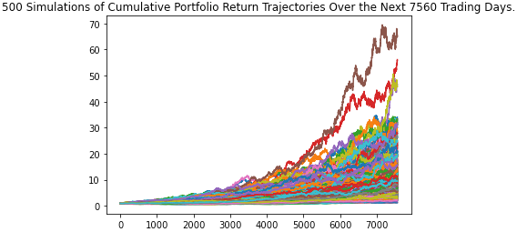

# Financial Planning

## Background

Create a tool that helps credit union members enhance their financial health. Develop a prototype application to present a demo in the next credit union assembly.

The credit union board wants to allow the union's members to assess their monthly personal finances, and also be able to forecast a reasonability good retirement plan based on cryptocurrencies, stocks, and bonds.

Focus on using APIs as part of the technical solution.

Create two financial analysis tools:

* The first will be a personal finance planner that will allow users to visualize their savings composed by investments in shares and cryptocurrencies to assess if they have enough money as an emergency fund.

* The second tool will be a retirement planning tool that will use the Alpaca API to fetch historical closing prices for a retirement portfolio composed by stocks and bonds and then run Monte Carlo simulations to project the portfolio performance at 30 years. Anaylze portfolios. 

---

### Files

* [Personal Finance Planner starter code](Starter_Code/financial-planner.ipynb)

* [MCForecastTools toolkit](Starter_Code/MCForecastTools.py)

---

### Part 1 - Personal Finance Planner

Personal finance planner application. To develop the personal finance planner prototype, you should take into account the following assumptions:

* The average household income for each member of the credit union is $12,000.

* Every union member has a savings portfolio composed of cryptocurrencies, stocks, and bonds.

Complete the following steps:

#### Collect Crypto Prices Using the `requests` Library

Assume the following amount of crypto assets: `1.2` BTC and `5.3` ETH.

1. Create a variable called `monthly_income` and set its value to `12000`.

2. Use the `requests` library to fetch the current price in US dollars of bitcoin (`BTC`) and ethereum (`ETH`) using the API endpoints provided.

3. Parse the API JSON response to pick the crypto prices and store each price in a variable.

    **Hint:** Be aware of the particular identifier for each cryptocurrency in the API JSON response, the bitcoin identifier is `1` whereas ethereum is `1027`.

4. Compute the value in US dollars of the current amount of cryptocurrencies and print the results.

#### Collect Investments Data Using Alpaca: `SPY` (stocks) and `AGG` (bonds)

Assume the following amount of shares: `200` `AGG` (bonds) and `50` `SPY` (stocks).

**Important:** Remember to create a `.env` file in your working directory to store the values of your Alpaca API key and Alpaca secret key.

1. Create the Alpaca API object using the `tradeapi.REST` function from the Alpaca SDK.

2. Format the current date as ISO format. You may change the date set in the starter code to Today's date.

3. Get the current closing prices for `SPY` and `AGG` using the Alpaca's `get_barset()` function. Transform the function's response to a Pandas DataFrame.

4. Pick the `SPY` and `AGG` close prices from the Alpaca's `get_barset()` DataFrame response and store them as Python variables. Print the closing values for validation.

5. Compute the value in US dollars of the current amount of shares and print the results.

#### Savings Health Analysis

Assess the financial health of the credit union's members.

1. To analyze savings health, create a DataFrame called `df_savings` with two rows. Store the total value in US dollars of the crypto assets in the first row and the total value of the shares in the second row.

    **Hint:** The `df_savings` DataFrame should have one column `amount` with two rows with `crypto` and `shares` as index values.

2. Use the `df_savings` DataFrame to plot a pie chart to visualize the composition of personal savings.

3. Use `if` conditional statements to validate if the current savings are enough for an emergency fund. An ideal emergency fund should be equal to three times your monthly income.

    * If total savings are greater than the emergency fund, display a message congratulating the person for having enough money in this fund.

    * If total savings are equal to the emergency fund, display a message congratulating the person on reaching this financial goal.

    * If total savings are less than the emergency fund, display a message showing how many dollars away the person is to reach the goal of saving at least three times their monthly expenses.

### Part 2 - Retirement Planning

Use the Alpaca API to fetch historical closing prices for a retirement portfolio and then run Monte Carlo simulations to project the portfolio performance at `30` years. You will then use the Monte Carlo data to analyze the portfolio.

Complete the following:

#### Monte Carlo Simulation

Use the MCForecastTools toolkit to create a Monte Carlo simulation for the retirement portfolio:

1. Use the Alpaca API to fetch five years historical closing prices for a traditional `40/60` portfolio using the `SPY` and `AGG` tickers to represent the `60%` stocks (`SPY`) and `40%` bonds (`AGG`).

2. Run a Monte Carlo Simulation of `500` runs and `30` years for the `40/60` portfolio and plot the results.

    

3. Plot the probability distribution and confidence intervals.

    

#### Retirement Analysis

Fetch the summary statistics from the Monte Carlo simulation results to answer the following questions:

1. Given an initial investment of $20,000, what is the expected portfolio return in dollars at the `95%` lower and upper confidence intervals?

2. How would a `50%` increase in the initial investment amount affect the expected portfolio return in dollars at the `95%` lower and upper confidence intervals?

### Early Retirement - Option

Try adjusting the portfolio to either include more risk (a higher stock than bond ratio) or to have a larger initial investment and re-run the retirement analysis to see what it would take to retire in `5` or `10` years instead of `30`!

---

### Resources

* [AlpacaDOCS](https://alpaca.markets/docs/)

* [Free Crypto API Documentation](https://alternative.me/crypto/api/)

---

### Hints and Considerations

* For the Monte Carlo simulation, start out by running `100` simulations for one year of returns, and when you have the code worked out, run the simulation at `100–500` simulations for `30` years.

* Remember to add the `.env` files to the `.gitignore` configuration to avoid exposing your API keys.

